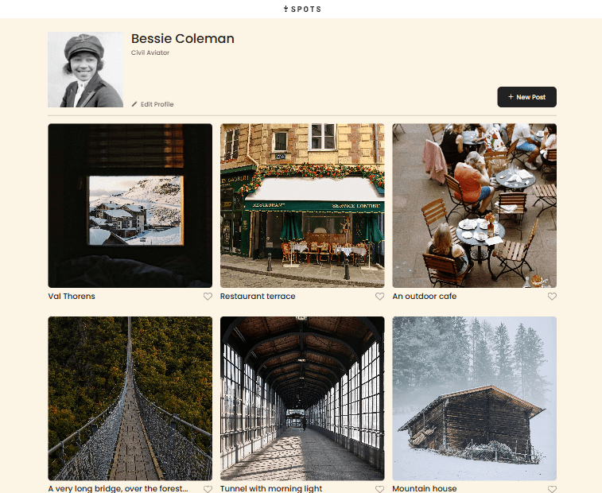
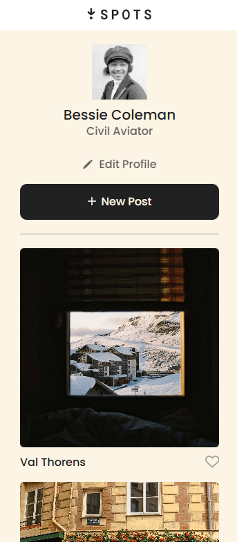
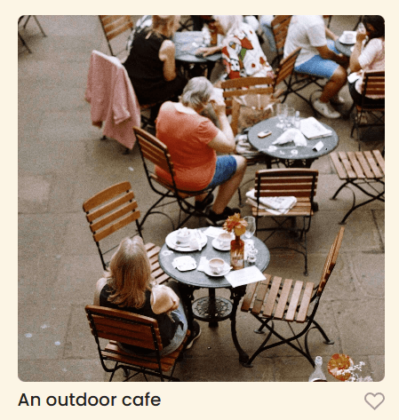

# Project 3: Spots

### Overview

- Description
- Tech Stack
- Project Images
- Deployment

## Description

This project gives a demonstration of a photo sharing site that is responsive to different device sizes. Currently, this project allows the user to view several different images belonging to a certain profile. There is an option to edit the profile, add new photos, or like the existing photos. While these options are available, they currently do not do anything. In future projects we will be tying the buttons to further functionality.

## Tech Stack

- HTML
- CSS
- Responsive Web Design
- Grid layouts

## Deployment

This webpage is deployed to github pages. You can find the deployed page at the following URL: 

https://mybaretibs.github.io/se_project_spots/

## Project Video

Check out this video description of the project, linked here:

https://drive.google.com/file/d/17M6eTcRnXztPsuHfYFXnbh8hPKhd-7hp/view?usp=sharing

## Project Images

