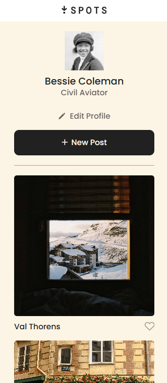
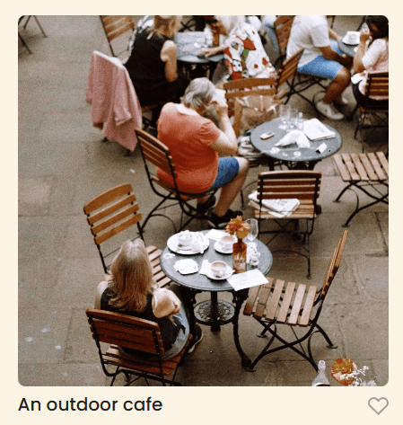

# Spots
**A responsive photo-sharing web app — built from scratch with vanilla JS, Webpack, and a real build pipeline**

**[Live Demo](https://imyellingtibbers.github.io/se_project_spots/)** · **[Video Walkthrough](https://drive.google.com/file/d/17M6eTcRnXztPsuHfYFXnbh8hPKhd-7hp/view?usp=sharing)**

---

Spots is a photo-sharing profile page inspired by early Instagram — clean card grid layout, modal-based editing, and full responsiveness across screen sizes. Built as a bootcamp project, but architected like something you'd actually ship: Webpack 5 with code splitting, PostCSS with autoprefixer and minification, Babel transpilation for broad browser support, and a one-command deploy to GitHub Pages.

The existing README undersells it. This isn't just HTML and CSS thrown into a folder — it's a properly bundled frontend app with a real dev/prod build distinction and an automated deployment pipeline.

---

## What it does

The app renders a user profile page — currently featuring aviator Bessie Coleman — with a responsive grid of photo cards. From the UI you can:

- **Edit the profile** name and description via a modal form
- **Add new posts** by supplying an image URL and caption
- **Like photos** on any card

The interface is fully responsive, collapsing gracefully from desktop grid layouts down to mobile single-column views.

---

## Screenshots

[](src/images/full_site.png)
*Desktop view — profile header with photo card grid*

[](src/images/small_view.png)
*Mobile view — responsive single-column layout*

[](src/images/card_view.png)
*Card detail — like button and caption*

---

## How it's built

The tech stack goes deeper than the surface suggests:

**Webpack 5** handles the full build pipeline — JS bundling, CSS extraction via `mini-css-extract-plugin`, HTML templating via `html-webpack-plugin`, and cache-busting via content hashes on output filenames. The dev server runs with hot reload; the production build minifies and tree-shakes automatically.

**PostCSS** processes all stylesheets with autoprefixer (vendor prefixes added automatically for cross-browser compatibility) and cssnano (CSS minification in production). No manual prefixing, no bloated stylesheets.

**Babel** with `@babel/preset-env` and `core-js` polyfills ensures the JS works across older browsers without writing anything twice.

**Responsive layout** is handled entirely in CSS — CSS Grid for the card grid, flexible units throughout, and media queries that adapt the layout at each breakpoint rather than just scaling things down.

**Deployment** is one command: `npm run deploy` triggers a production build and pushes the `dist/` folder to GitHub Pages via the `gh-pages` package.

---

## Running locally

```bash
npm install
npm run dev
```

Production build:

```bash
npm run build
```

Deploy to GitHub Pages:

```bash
npm run deploy
```

---

## Tech stack

| | |
|---|---|
| JavaScript | Vanilla ES6+ |
| Styles | CSS with PostCSS (autoprefixer, cssnano) |
| Bundler | Webpack 5 |
| Transpiler | Babel with core-js polyfills |
| Deployment | GitHub Pages via gh-pages |
